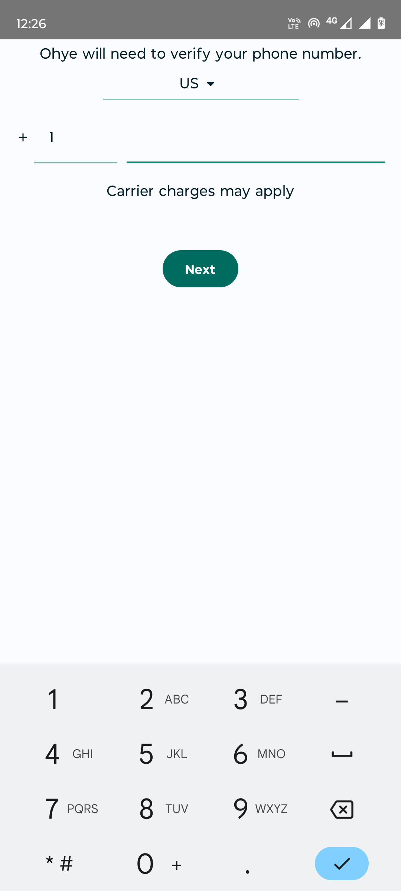
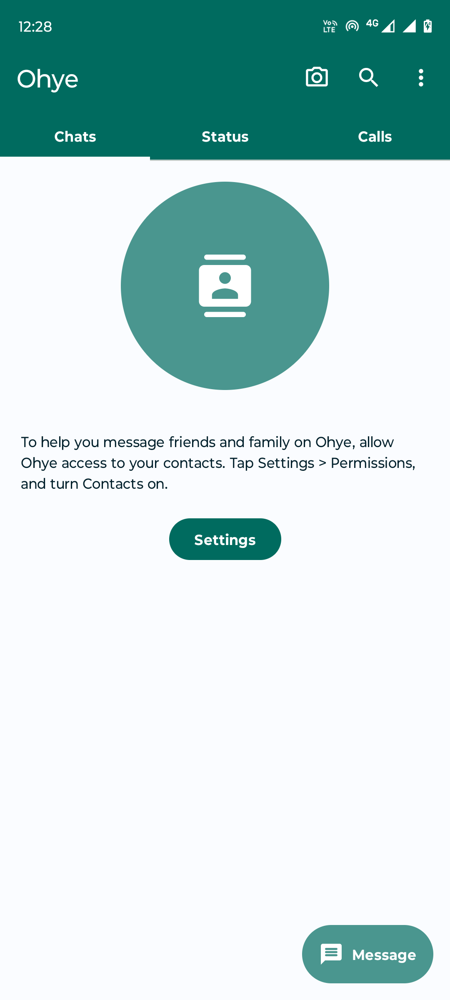
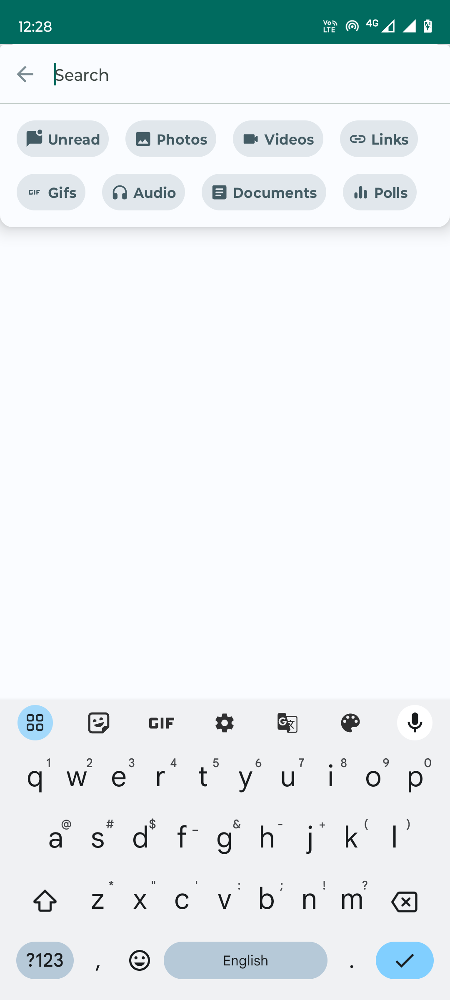
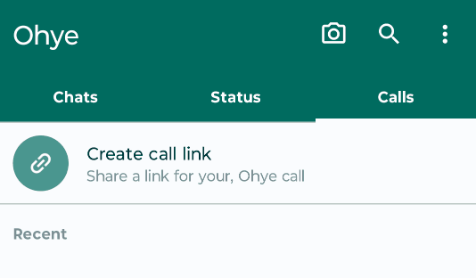
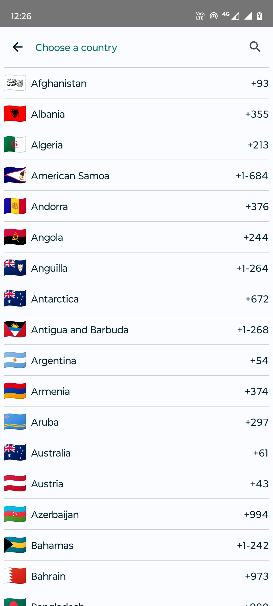
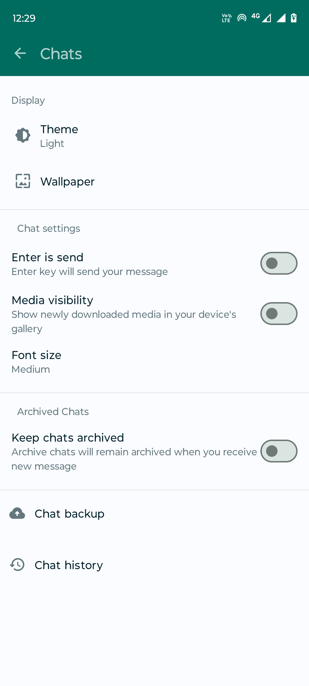
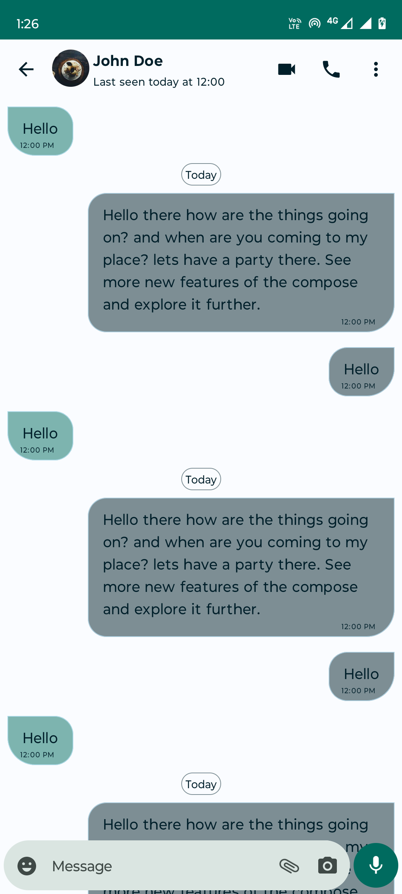
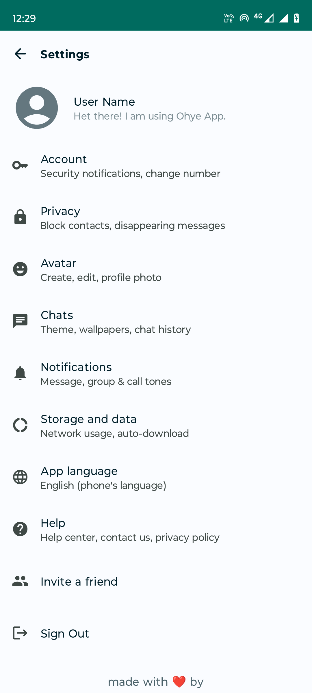
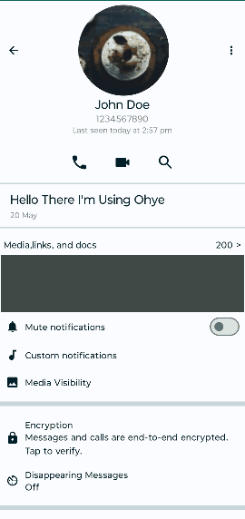

# BitOhye App

BitOhye is a WhatsApp clone built using Jetpack Compose. It provides a modern and attractive user interface for messaging and communication. Work is still in progress, and more features will be added soon.

## Screens

### 1. Phone Authentication

The phone authentication screen allows users to enter their phone number to verify their identity and log into the app. It features a sleek and minimalistic design.

### 2. Home

The home screen is the main screen of the app, where users can see their recent chats, group chats, and contact list. It has a clean and intuitive layout, with smooth transitions and animations.

### 3. Search

The search screen enables users to search for specific contacts or conversations. It has a modern search bar design and displays search results in real-time as the user types.

#### Search Animation

The search animation showcases the dynamic search experience in action. It provides a visually engaging and interactive way for users to find what they are looking for.

### 4. Country Code Search

The country code search screen assists users in selecting the appropriate country code when entering their phone number. It offers a user-friendly search functionality to quickly find the desired country code.

### 5. Chats

The chats screen displays the user's active conversations. It presents messages in a threaded format with sender avatars and timestamps. The interface is designed for easy readability and quick access to chat functionalities.

#### Chat Screen

The chat screen provides a seamless messaging experience. Users can send and receive messages, view media files, and interact with various chat features in an intuitive interface.

### 6. Settings

The settings screen allows users to customize their app preferences and account settings. It offers a visually appealing interface with neatly organized options and intuitive navigation.

#### Profile Animation

The profile animation demonstrates the smooth and interactive profile experience. Users can easily view and manage their profile information with delightful animations.

## Requirements

- Android 7	API Level 24 Android 7.0 (Nougat) or higher
- Jetpack Compose 1.4.6 or higher
- Kotlin 1.8.20 or higher

## Installation

1. Clone the repository: `git clone https://github.com/manish381364/BitOhye.git`
2. Open the project in Android Studio.
3. Build and run the app on an Android device or emulator.

## Contributions

Contributions are welcome! If you encounter any issues or have suggestions for improvements, please open an issue or submit a pull request.

## License

This project is licensed under the [MIT License](LICENSE).

